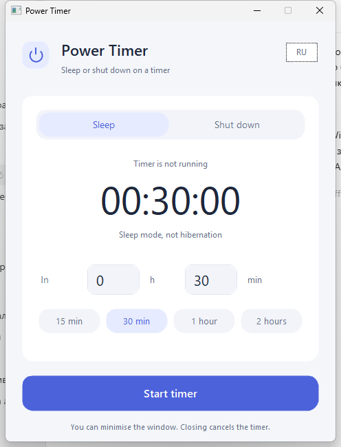

# Power Timer

[](https://isocpp.org/)
[](https://cmake.org/)
[](https://www.fltk.org/)
[](LICENSE)
[](.github/workflows/build.yml)

Power Timer is a small desktop timer for putting a computer to sleep or shutting it down. It has one window, no background service, no network access, and no stored settings.

Release **0.0.1** · C++17 · CMake 3.24+ · FLTK 1.4.5 · Windows, macOS, Linux

Русская версия: [README.ru.md](README.ru.md)



## Features

- Sleep or shut down after 1 minute to 24 hours.
- Presets for 15 minutes, 30 minutes, 1 hour, and 2 hours.
- Countdown, expected local execution time, and cancellation with the button or Escape.
- English is the default interface language; use `--lang ru` for Russian.
- `--dry-run` and `--smoke-test` for safe checks that never change power state.

## Timer limits

The countdown exists only in the running application. Closing it, logging out, rebooting, or a crash cancels the timer; no system task is created. The computer must remain awake. Power Timer does not prevent sleep and does not wake the computer.

If a timer tick is delayed by more than 10 seconds, or the wall clock differs materially from the monotonic clock, the timer cancels itself. A short sleep of up to 10 seconds may not be detected. At zero, cancellation is unavailable: one system request is submitted and never retried. An accepted request does not prove that sleep or shutdown has completed. Save open work first.

On macOS, App Nap is disabled only while counting down. Linux requires systemd 248+, systemd-logind, `busctl`, and `systemctl`; run as a regular user, not with `sudo`.

## Build

The first configure downloads pinned FLTK 1.4.5 sources and verifies SHA-256. A C++17 compiler is required.

### Windows

With Visual Studio 2022+ and C++ desktop tools:

```powershell
cmake -S . -B build -A x64
cmake --build build --config Release --parallel
ctest --test-dir build -C Release --output-on-failure
.\build\Release\PowerTimer.exe
```

### macOS

With Xcode Command Line Tools:

```sh
cmake -S . -B build -DCMAKE_BUILD_TYPE=Release
cmake --build build --parallel
ctest --test-dir build --output-on-failure
./build/PowerTimer
```

### Linux

Debian/Ubuntu, using the default X11/XWayland backend:

```sh
sudo apt install cmake g++ make libx11-dev libxext-dev libxft-dev libxinerama-dev libxcursor-dev libxfixes-dev libxrender-dev libfontconfig1-dev
cmake -S . -B build -DCMAKE_BUILD_TYPE=Release
cmake --build build --parallel
ctest --test-dir build --output-on-failure
./build/power-timer
```

## Safe checks and documentation

```sh
./build/power-timer --dry-run --smoke-test
```

On Windows use `.\build\Release\PowerTimer.exe --dry-run --smoke-test`; on macOS use `./build/PowerTimer --dry-run --smoke-test`. Core tests can be built without FLTK with `-DPOWER_TIMER_BUILD_APP=OFF`.

See [docs/VALIDATION.md](docs/VALIDATION.md) for tested and untested paths and [docs/RELEASING.md](docs/RELEASING.md) for the release checklist.

## Code quality

Install `clang-format` and `clang-tidy`, then use the project targets and option:

```sh
cmake -S . -B build
cmake --build build --target check-format # verify formatting
cmake --build build --target format       # apply formatting
cmake -S . -B build-tidy -DPOWER_TIMER_BUILD_APP=OFF -DPOWER_TIMER_ENABLE_CLANG_TIDY=ON
cmake --build build-tidy --parallel
```

The same formatting and static-analysis checks run in GitHub Actions.

## Releases

Run **Actions → Build and release → Run workflow** manually. Enter a version matching `CMakeLists.txt` and `CHANGELOG.md`. With `create_release` disabled, Actions publishes three individual executable artifacts. With it enabled, the workflow creates a draft GitHub release containing the same three binaries, targeted at the workflow commit. It creates the `v<version>` tag only for that draft release.

On macOS and Linux, make a downloaded binary executable with `chmod +x`. Use `--license` to display the embedded application and third-party notices.

## License

Power Timer is released under the [MIT License](LICENSE). Third-party notices for FLTK are in [THIRD_PARTY.md](THIRD_PARTY.md).
